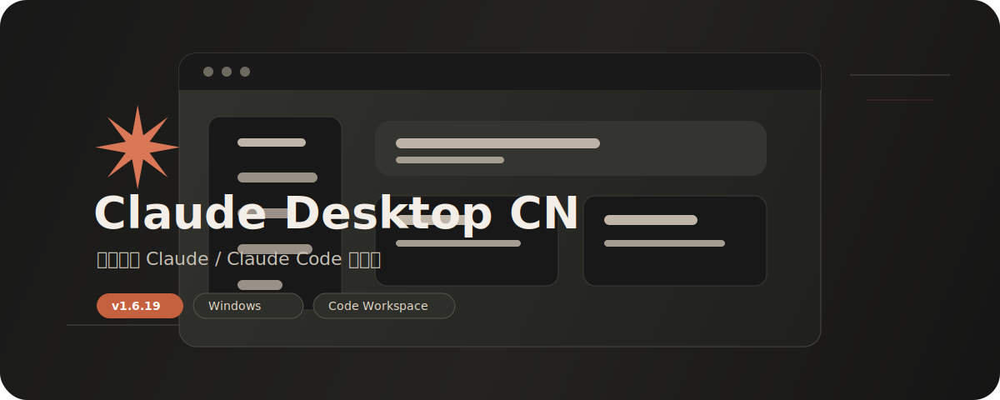

# Claude Desktop CN

<p align="center">
  
</p>

<p align="center">
  <a href="https://github.com/Qiao-920/claude-desktop-cn/releases"></a>
  <a href="https://github.com/Qiao-920/claude-desktop-cn/actions"></a>
  
  
</p>

面向中文用户持续维护的 Claude Desktop 中文桌面分支，基于 [`pretend1111/claude-desktop-app`](https://github.com/pretend1111/claude-desktop-app) 二次整理、汉化和增强。

这个分支的目标不是简单换皮，而是把原本零散、半占位的能力逐步打磨成一套可维护、可发布、可日用的桌面工作流：中文聊天、项目上下文、GitHub 导入、本地 Code 工作区、权限守卫、命令执行和 Artifact 预览。

## 下载

| 项目 | 内容 |
| --- | --- |
| 当前版本 | `1.6.26` |
| Windows 安装包 | `Claude-Desktop-CN-Setup-1.6.26.exe` |
| 下载页面 | [GitHub Releases](https://github.com/Qiao-920/claude-desktop-cn/releases) |
| 本轮更新说明 | [Claude Desktop CN v1.6.26](docs/releases/v1.6.26-cn.md) |
| 产品任务清单 | [cc-haha 能力对照与 Claude Desktop CN 产品任务清单](docs/cc-haha-capability-map.md) |

默认安装路径通常是：

```text
C:\Users\Administrator\AppData\Local\Programs\claude-desktop\
```

## 当前重点

- `P0`：工作区、命令执行、权限、预览稳定性
- `P1`：MCP 真功能化、Skills 中文化 / 防穿模、Project / Cowork
- 当前主线：`P0 + P1` 一起推进，按“整块迁移”做

## 已落地能力

### Code 工作区

- 选择本地工作区
- 文件树浏览、预览、编辑、保存
- 单文件 diff、Git 状态、暂存、撤销暂存、提交、推送
- Shell 偏好、常用命令、命令历史
- 权限模式、风险命令审批、命令审计
- 工作区健康检查与修复建议

### MCP

- 服务列表、新增、删除、启停
- 连接测试、环境变量保存
- stdio 工具发现
- 真实 `tools/call`
- 参数表单、JSON 调用和调用审计

### Skills

- 技能列表、启用状态、详情面板
- 中文说明缓存与英文原文回显
- 项目绑定、触发示例
- 聊天菜单按当前项目优先推荐
- 内置 Skill 来源脱敏，避免路径穿模

### Project / Cowork

- 项目列表、项目文档、项目聊天分组
- 项目状态卡、负责人、里程碑、下一步动作
- 项目任务板：待处理 / 进行中 / 阻塞 / 已完成
- 项目时间线与 Cowork 首页摘要卡
- 派生到本地 Code、派生到新工作树

### 预览

- HTML / React Artifact 沙箱预览
- 空白检测、脚本错误、console 日志
- 资源加载失败和请求失败提示

## 构建

```bash
npm install
npm run build
npm run electron:build:win
```

## 文档

- [v1.6.26 发布说明](docs/releases/v1.6.26-cn.md)
- [能力对照与任务清单](docs/cc-haha-capability-map.md)

## 仓库

- GitHub：[Qiao-920/claude-desktop-cn](https://github.com/Qiao-920/claude-desktop-cn)
