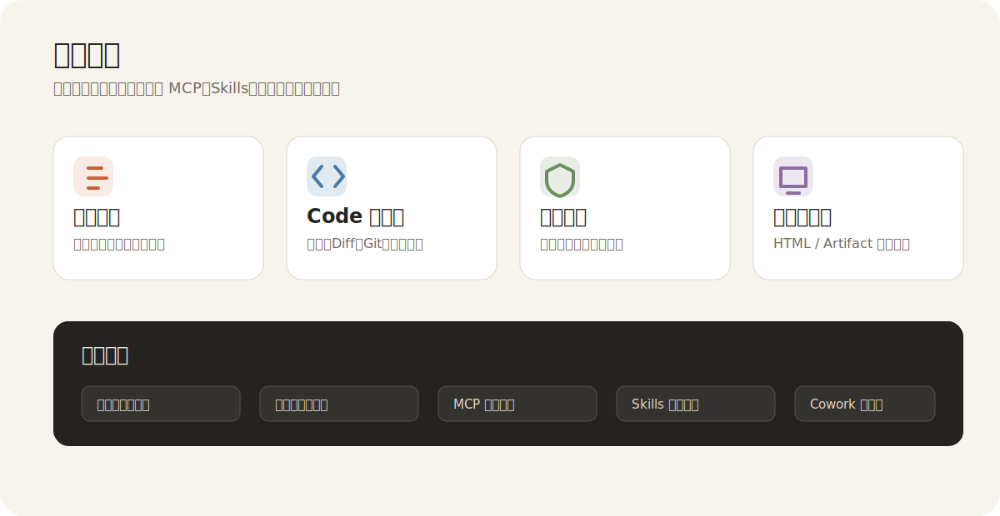

# Claude Desktop CN

<p align="center">
  
</p>

<p align="center">
  <a href="https://github.com/Qiao-920/claude-desktop-cn/releases"></a>
  <a href="https://github.com/Qiao-920/claude-desktop-cn/actions"></a>
  
  
</p>

面向中文用户持续维护的 Claude 风格桌面客户端分支，基于 [`pretend1111/claude-desktop-app`](https://github.com/pretend1111/claude-desktop-app) 二次整理、汉化和增强。

这个分支的目标不是简单换皮，而是把原本零散、半占位的能力慢慢补成一套可维护、可发布、可日用的桌面工作流：中文聊天、项目上下文、GitHub 导入、本地 Code 工作区、权限守卫、命令执行和 Artifact 预览。

## 下载

| 项目 | 内容 |
| --- | --- |
| 当前版本 | `1.6.19` |
| Windows 安装包 | `Claude-Desktop-CN-Setup-1.6.19.exe` |
| 下载页面 | [GitHub Releases](https://github.com/Qiao-920/claude-desktop-cn/releases) |
| 本轮更新说明 | [Claude Desktop CN v1.6.19](https://github.com/Qiao-920/claude-desktop-cn/releases/tag/v1.6.19) |
| 产品任务清单 | [cc-haha 能力对照与 Claude Desktop CN 产品任务清单](docs/cc-haha-capability-map.md) |

默认安装路径通常是：

```text
C:\Users\Administrator\AppData\Local\Programs\claude-desktop\
```

## 产品能力

<p align="center">
  
</p>

### 中文桌面体验

- 主界面、设置页、协作页、代码页持续中文化。
- 支持中文 / 英文 UI 切换。
- 清理零散英文文案，让界面更像一个正式客户端。
- 收紧聊天正文、输入区和设置页布局，降低大屏空旷感。

### GitHub 连接

- 支持配置自己的 GitHub OAuth App。
- 不再复用原作者的 Client ID / Client Secret。
- 支持 GitHub 仓库导入和项目资料来源绑定。

OAuth 回调地址：

```text
http://127.0.0.1:30080/api/github/callback
```

### Code 工作区

当前已经支持：

- 选择本地工作区。
- 文件树浏览、文件预览、编辑、保存。
- HTML / Artifact 预览。
- 新建文件、新建文件夹、重命名、删除。
- Git 状态查看、单文件 diff、暂存、取消暂存、丢弃修改。
- 提交、推送、提交后自动推送。
- Shell 偏好、常用命令快捷入口、命令历史。
- 命令执行权限守卫、风险命令拦截、超时控制。
- 命令输出显示 Shell、退出码、耗时、权限模式和超时状态。

### Cowork 协作页

协作页已经从空白说明页升级为工作总览：

- 项目、GitHub、权限、归档状态总览。
- 快捷入口：项目、代码工作区、权限环境设置。
- 当前队列：提示下一步应该连接什么、整理什么。
- 最近项目列表。
- 协作 / 代码页职责边界说明。

它现在仍不是完整多人协作系统，但已经具备真实产品页的骨架和入口。

### Settings 设置页

设置页已经补齐原生 Claude / Codex 风格的第一版骨架：

- 常规、外观、模型、个性化、权限。
- Git、MCP 服务器、环境、工作树。
- 已归档聊天、使用情况。

其中 Git、MCP、环境、工作树、已归档聊天、使用情况已经不再是单纯占位，而是有状态、有入口、有说明的可继续扩展页面。

## 首次使用

### 1. 选择用户模式

- 自部署：使用自己的 API Key / Base URL。
- Clawparrot：使用托管 API 服务。

### 2. 连接 GitHub

1. 在 GitHub 创建 OAuth App。
2. 回调地址填写：

```text
http://127.0.0.1:30080/api/github/callback
```

3. 把 Client ID / Client Secret 配到客户端。
4. 在客户端重新走一次 GitHub 连接流程。

### 3. 使用 Code 工作区

建议流程：

1. 打开 `代码`。
2. 选择一个本地工作区。
3. 确认当前权限模式。
4. 浏览、编辑文件，查看 Git 状态，再执行命令。

## 路线图

下一阶段会继续补这些方向：

| 优先级 | 方向 | 目标 |
| --- | --- | --- |
| P0 | 工作区健康检查 | 选择目录后自动识别 Git、Node、Python、包管理器和可运行脚本。 |
| P0 | 命令审批与审计 | 让高风险命令有更清晰的确认、记录和回滚提示。 |
| P1 | MCP 服务器 | 从设置页骨架升级成真实服务器列表、启停、环境变量和连接测试。 |
| P1 | Skills | 增加中文解释、启用状态、详情页和项目绑定。 |
| P1 | Cowork | 做成任务看板、上下文整理和审阅入口，而不是纯说明页。 |

## 发布说明

更新内容不再堆在 README 首页，版本日志统一放在 GitHub Releases 和 `docs/releases` 目录：

- [v1.6.19 发布说明](docs/releases/v1.6.19-cn.md)
- [全部 Releases](https://github.com/Qiao-920/claude-desktop-cn/releases)

## 支持

- 售后支持 QQ：`2592056451`

## 致谢

上游项目：

- [pretend1111/claude-desktop-app](https://github.com/pretend1111/claude-desktop-app)

参考项目：

- [NanmiCoder/cc-haha](https://github.com/NanmiCoder/cc-haha)

本分支会持续跟进上游可复用更新，但只并入适合当前路线的内容。
